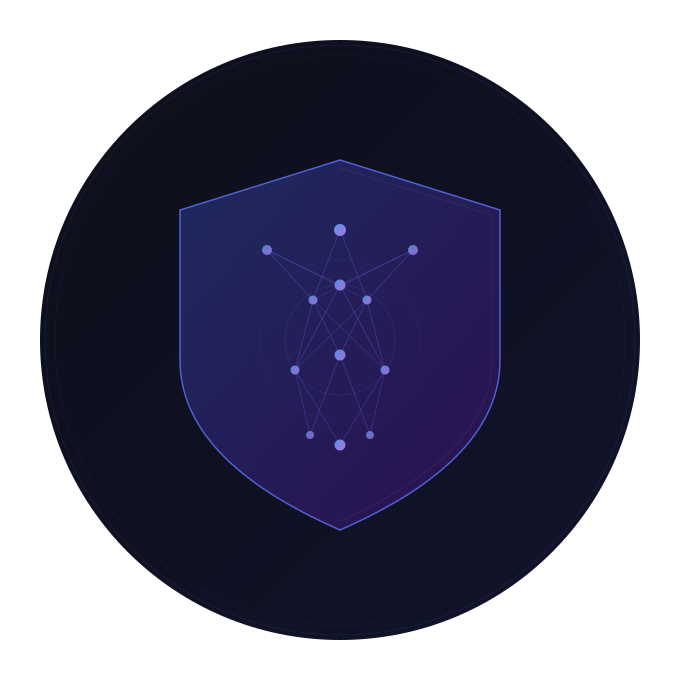
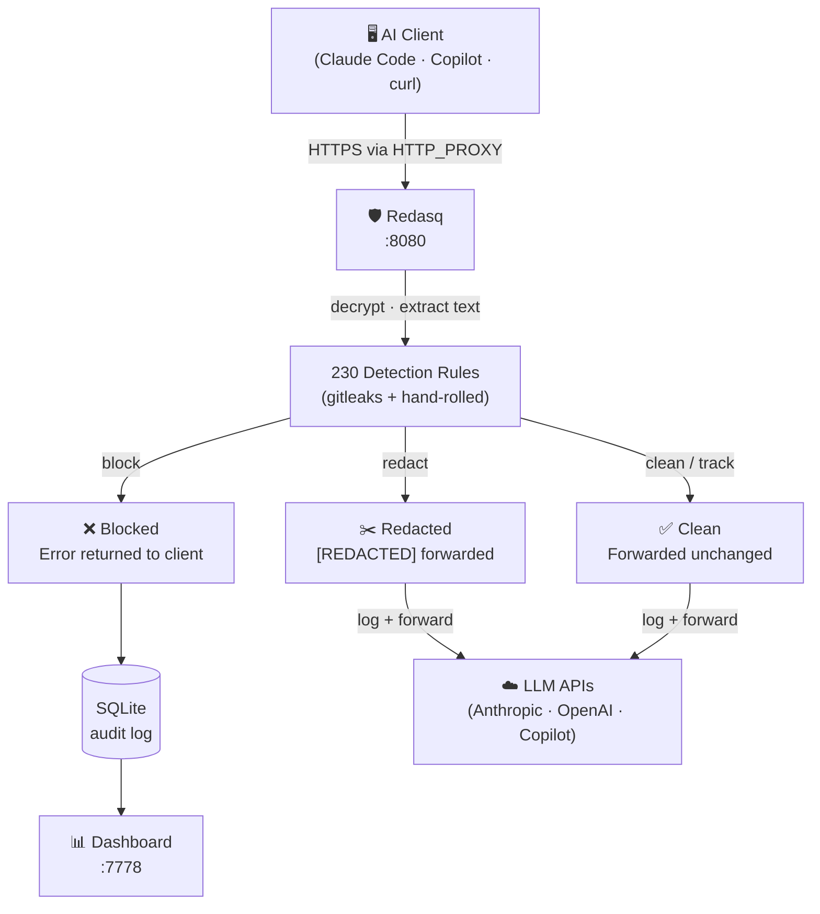

<p align="center">
  
</p>

<p align="center">
  <a href="#why">Why</a> ·
  <a href="#features">Features</a> ·
  <a href="#install">Install</a> ·
  <a href="#setup">Setup</a> ·
  <a href="#client-notes">Client notes</a> ·
  <a href="#rules">Rules</a> ·
  <a href="#agent-mode">Agent mode</a> ·
  <a href="#ml-classifier">ML classifier</a> ·
  <a href="#options">Options</a> ·
  <a href="#architecture">Architecture</a>
</p>

# Redasq

A local HTTPS proxy that intercepts every prompt sent to AI coding assistants — blocking or redacting sensitive data before it reaches the model.


---

## Why

AI tools like Claude Code, GitHub Copilot, and ChatGPT receive your full editor context on every request. That context routinely contains API keys, passwords, database credentials, SSNs, and internal IP addresses — sent to third-party servers without you noticing.

Redasq sits between your tools and the AI APIs, inspects every prompt in real time, and either **blocks** the request or **redacts** the sensitive value before forwarding.

- [GitGuardian State of Secrets Sprawl 2026](https://blog.gitguardian.com/the-state-of-secrets-sprawl-2026/) — 29M secrets exposed on public GitHub; AI-service leaks up 81% YoY
- [AI Coding Assistants Drive Surge in Secret Leaks](https://oecd.ai/en/incidents/2026-03-17-2273) — Claude Code-assisted commits leak secrets at 2× the rate of human developers
- [How AI Assistants Leak Secrets in Your IDE](https://www.knostic.ai/blog/ai-coding-assistants-leaking-secrets) — practical breakdown of how IDE context ends up in AI API requests
- [Researchers Uncover 30+ Flaws in AI Coding Tools](https://thehackernews.com/2025/12/researchers-uncover-30-flaws-in-ai.html) — data theft and RCE via prompt injection in Cursor and similar tools

## Features

- **Block or redact** — block-mode rules reject the request outright; redact-mode rules replace the sensitive value with `[REDACTED]` and forward the sanitised prompt
- **230 built-in rules** — 221 from the [gitleaks](https://github.com/gitleaks/gitleaks) ruleset (AWS, GCP, GitHub, Stripe, Twilio, …) plus 9 hand-rolled rules for PII (SSN, credit cards, DB connection strings)
- **Live dashboard** — real-time feed of intercepted prompts with status, matched rules, latency, token usage, model, and session ID
- **Rule editor** — toggle rule modes in the dashboard; changes write to `rules.json` instantly, no restart needed
- **Agent mode** — switches all rules to redact so long-running agents are never hard-blocked mid-task; persists across restarts
- **SQLite audit log** — full history survives restarts
- **Single binary** — no runtime dependencies, no cloud calls

## Intercepted hosts

| Service | Hosts |
|---|---|
| Anthropic | `api.anthropic.com`, `claude.ai`, `*.anthropic.com` |
| OpenAI | `api.openai.com`, `*.openai.com` |
| GitHub Copilot | `api.githubcopilot.com`, `*.githubcopilot.com`, `copilot-proxy.githubusercontent.com` |

All other HTTPS traffic is tunnelled through unchanged.

---

## Install

### Homebrew (macOS / Linux)

```bash
brew tap chaudharydeepak/tap
brew install redasq
```

### Build from source

```bash
git clone https://github.com/chaudharydeepak/redasq
cd redasq
go build -o redasq .
```

Requires Go 1.21+.

---

## Setup

### 1. Start the proxy

```bash
# Foreground
redasq

# Background service — auto-starts on login (Homebrew only)
brew services start chaudharydeepak/tap/redasq
```

On first run, a local CA cert is generated at `~/.redasq/ca.crt`. The proxy binds to `:8080` and the dashboard to `:7778`.

### 2. Set the proxy environment variables

Add to `~/.zshrc` (or `~/.bashrc`) and reload:

```bash
export HTTP_PROXY=http://localhost:8080
export HTTPS_PROXY=http://localhost:8080
export NO_PROXY=localhost,127.0.0.1
source ~/.zshrc
```

This is sufficient for pure Go / native CLI tools. Claude Code additionally needs `NODE_EXTRA_CA_CERTS`; Copilot CLI and browsers need the system CA cert — see below.

### 3. Open the dashboard

```
http://localhost:7778
```

---

## Client notes

### Claude Code

Node.js-based. Add this alongside the proxy vars — no system keychain change needed:

```bash
export NODE_EXTRA_CA_CERTS=~/.redasq/ca.crt
```

### Copilot CLI

Electron-based (uses Chromium's cert store). Requires the CA cert to be installed system-wide:

**macOS:**
```bash
sudo security add-trusted-cert -d -r trustRoot \
  -k /Library/Keychains/System.keychain ~/.redasq/ca.crt
```

**Linux:**
```bash
sudo cp ~/.redasq/ca.crt /usr/local/share/ca-certificates/redasq.crt
sudo update-ca-certificates
```

### VS Code Copilot

In VS Code settings (`Cmd+,`):

```json
"http.proxy": "http://localhost:8080",
"http.proxyStrictSSL": false
```

Restart VS Code.

### CA cert (Chrome / Safari)

Same system-wide install as Copilot CLI above — use the same commands.

---

## Rules

### Modes

| Mode | Behaviour |
|---|---|
| **Block** | Request rejected; nothing forwarded to the AI |
| **Track** | Sensitive value replaced with `[REDACTED]`; sanitised prompt forwarded and logged |

### Built-in rules

**221 gitleaks rules** — service-specific token patterns for 200+ providers (AWS `AKIA…`, GitHub `ghp_…`, Anthropic `sk-ant-api03-…`, Stripe, Twilio, GCP, Azure, …). All set to **Block**.

**9 hand-rolled rules:**

| Rule | Severity | Mode |
|---|---|---|
| Social Security Number | High | Block |
| Credit Card (Luhn-validated) | High | Block |
| Database Connection String | High | Block |
| HTTP Basic Auth | High | Block |
| HTTP Bearer Token | High | Block |
| Generic Secret / Password | Medium | Block |
| Email Address | Low | Track |
| Internal IP (RFC-1918) | Low | Track |

All rules are visible in the dashboard and can be changed at any time without restarting.

### Custom rules

`~/.redasq/rules.json` — created automatically when you first change a rule in the dashboard.

**Override a built-in rule:**
```json
{
  "overrides": [
    { "id": "email", "mode": "block" }
  ]
}
```

**Add a custom rule:**
```json
{
  "rules": [
    {
      "id": "acme-token",
      "name": "Acme Internal Token",
      "pattern": "ACME-[A-Z0-9]{32}",
      "severity": "high",
      "mode": "block"
    }
  ]
}
```

---

## Agent mode

Long-running agents (Claude Code, Cursor, automated pipelines) can be hard-blocked mid-task if sensitive data appears in context. Agent mode prevents this.

Toggle from the dashboard header:

- **OFF (default)** — rules fire as configured; block-mode rules reject the request and the agent stops
- **ON** — all rules switch to redact; sensitive values are masked but the request always goes through

State persists across restarts. Each request is tagged in the dashboard so you can see which calls were made while agent mode was active.

---

## ML classifier (optional)

An optional second-layer detector that runs a small local LLM in parallel with the regex engine. Catches natural-language disclosures regex can't pattern-match (e.g. `my username is alice and the password is hunter`). **Opinion-only** — the verdict is written to the prompt row and shown in the dashboard but never gates the block/forward decision.

### Setup

**1. Install `llama.cpp`**

```bash
# macOS
brew install llama.cpp

# Linux — use the official release tarball (most distros don't ship a current package)
# https://github.com/ggml-org/llama.cpp/releases
```

**2. Drop a GGUF model**

```bash
mkdir -p ~/.redasq/models
curl -L -o ~/.redasq/models/qwen2.5-3b-instruct-q4_k_m.gguf \
  https://huggingface.co/Qwen/Qwen2.5-3B-Instruct-GGUF/resolve/main/qwen2.5-3b-instruct-q4_k_m.gguf
```

The default model path is `~/.redasq/models/qwen2.5-3b-instruct-q4_k_m.gguf`. Point `--ml-model <path>` at a different file to override.

**3. Run redasq normally**

```
redasq
# → ml: spawning llama-server with qwen2.5-3b-instruct-q4_k_m.gguf ...
# → ml: ready at http://127.0.0.1:8765 (model=qwen2.5-3b-instruct-q4_k_m.gguf)
```

If `llama-server` or the model file is missing, the ML layer is skipped with a one-line hint and redasq continues in regex-only mode.

### Bring your own model (BYOM)

Any instruction-tuned GGUF works — point `--ml-model` at it. Verified alternatives:

| Model | Size (Q4_K_M) | License | Notes |
|---|---|---|---|
| Qwen 2.5 3B Instruct | ~2.0 GB | Apache 2.0 | Default; benchmarked |
| Llama 3.2 3B Instruct | ~2.0 GB | Llama 3 Community | Drop-in replacement |
| Phi-3.5-mini 3.8B | ~2.4 GB | MIT | Permissive license; good for redistribution |
| Gemma 2 2B Instruct | ~1.6 GB | Gemma TOS | Smaller; slightly lower accuracy on natural-language disclosures |

Base (non-Instruct) models will fail the JSON-schema constraint and produce parse errors visible with `--debug`.

### Hardware requirements

For the default Qwen 2.5 3B Q4_K_M (~2 GB on disk, ~2.5 GB RAM at runtime):

| Tier | RAM | CPU / GPU | Latency per classification |
|---|---|---|---|
| Minimum | 4 GB free | x86_64 + AVX2 (Intel Haswell+, AMD Excavator+) or ARM64 + NEON | 5–10 s |
| Recommended | 8 GB | 8+ threads, AVX2/AVX-512 | 3–5 s |
| Optimal | 16 GB | Apple Silicon M2+ with Metal, or NVIDIA GPU with CUDA-built `llama.cpp` | 0.5–1.5 s |

The classifier runs in a background goroutine — slow inference never blocks the user's request. The dashboard ML column shows `—` while the verdict is pending, then fills in when the model returns.

### Disable

```bash
redasq --no-ml-classifier
```

---

## Options

```
--port              Proxy port (default: 8080)
--web-port          Dashboard port (default: 7778)
--ca-dir            Directory for CA cert, key, and database (default: ~/.redasq)
--upstream-proxy    Chain through a corporate proxy (e.g. http://proxy.corp.com:8080)
--debug             Verbose request/connection logging
--version           Print version and exit
--no-ml-classifier  Disable the parallel local-LLM classifier
--ml-binary         Path to llama-server binary (default: looked up in PATH)
--ml-model          Path to GGUF model (default: ~/.redasq/models/qwen2.5-3b-instruct-q4_k_m.gguf)
--ml-port           Port for the managed llama-server (default: 8765)
--ml-threads        Number of threads for llama-server (default: 8)
```

---

## Architecture


```mermaid
flowchart TD
    Client["🖥️ AI Client\n(Claude Code · Copilot · curl)"]
    PG["🛡️ Redasq\n:8080"]
    Rules["230 Detection Rules\n(gitleaks + hand-rolled)"]
    DB[("SQLite\naudit log")]
    Dashboard["📊 Dashboard\n:7778"]
    LLM["☁️ LLM APIs\n(Anthropic · OpenAI · Copilot)"]
    Blocked["❌ Blocked\nError returned to client"]
    Redacted["✂️ Redacted\n[REDACTED] forwarded"]
    Clean["✅ Clean\nForwarded unchanged"]

    Client -->|"HTTPS via HTTP_PROXY"| PG
    PG -->|"decrypt · extract text"| Rules
    Rules -->|"block"| Blocked
    Rules -->|"redact"| Redacted
    Rules -->|"clean / track"| Clean
    Blocked --> DB
    Redacted -->|"log + forward"| LLM
    Clean -->|"log + forward"| LLM
    DB --> Dashboard
```

```
redasq/
├── main.go              CLI entrypoint
├── proxy/
│   ├── ca.go            Local CA cert generation and leaf cert signing
│   ├── proxy.go         HTTP CONNECT handler, TLS MITM, request forwarding
│   └── intercept.go     Prompt extraction (Anthropic, OpenAI, Responses API)
├── inspector/
│   ├── engine.go        Rule matching engine (block, redact, track)
│   ├── rules.go         230 built-in rules
│   └── config.go        rules.json loading and write-back
├── mlclassifier/
│   ├── spawn.go         llama-server child-process lifecycle
│   ├── client.go        HTTP client for /v1/chat/completions
│   └── prompt.go        System prompt + JSON schema for disclosure verdict
├── store/
│   └── store.go         SQLite persistence
└── web/
    └── web.go           Embedded dashboard
```

## License

AGPL
